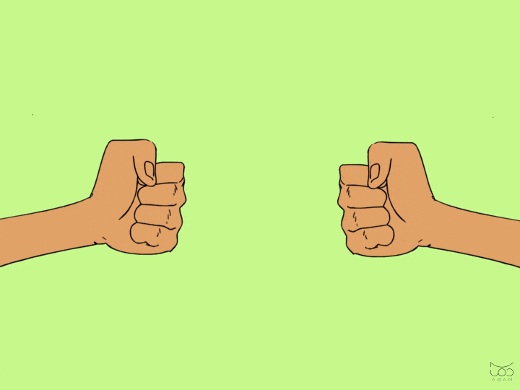

# 🎮 Rock Paper Scissors

## 📝 Description
This is a simple and fun **Rock Paper Scissors** game where the user plays against the computer.
You can **choose the maximum score** required to win the game.
After the game ends, you can **play again with a single click**.

---

## 🖼 Demo


---

## ✅ Features
- Play Rock, Paper, Scissors against the computer
- User-defined winning score limit
- Two modes:
  - Terminal mode (main.py)
  - Web GUI with Streamlit (gui_main.py)
- Displays each round result and final winner
- Option to play again

---

## 🎮 Game Rules
| Your Choice | Computer Choice | Result     |
|-------------|-----------------|------------|
| Rock        | Scissors        | ✅ You win |
| Scissors    | Paper           | ✅ You win |
| Paper       | Rock            | ✅ You win |
| Same choice | Same choice     | 🤝 Tie     |

---
## 🚀 How to Run

There are **two ways** to play the game:

---

### ✅ 1. Terminal Mode

1. Clone this repository and navigate into the project folder.
2. Install dependencies:
   ```bash
   pip install -r requirements1.txt
3. Run the game:
    ```bash
    python main.py

### ✅ 2. Web GUI Mode (Streamlit)

1. Clone this repository and navigate into the project folder.

2. Install dependencies:
    ```bash
    pip install -r requirements2.txt
3. Run the game with Streamlit:
    ```bash
    streamlit run gui_main.py

## 📁 Project Structure

```text
project/
│── src/
│ │── main.py # Terminal version of the game
│ │── gui_main.py # Web GUI version using Streamlit
│ │
│ └── utils/ # Helper/extra modules
│ │── game_again.py # Replay game logic (if used)
│ │── end_of_game.py # Game over logic (if used)
│
│── requirements1.txt # Dependencies for terminal version
│── requirements2.txt # Dependencies for GUI version
│── README.md # Project documentation
```
